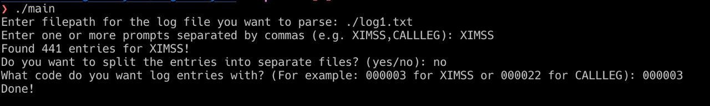
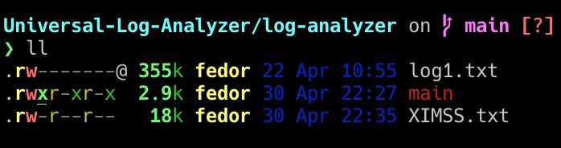
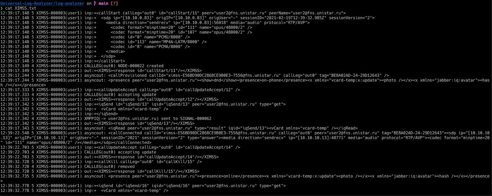

# Universal-Log-Analyzer
I tried making universal log analyzer. It was one of the cases on the Hackathon that I went to!

Well, it works by searching for patterns in a log file that user will provide.

## Installation
1. Clone this repo 
2. Cd into the log-analyzer folder
3. ```chmod +x ./main``` to make main file executable
4. ```./main``` to run the file
5. Enjoy!

## Images



